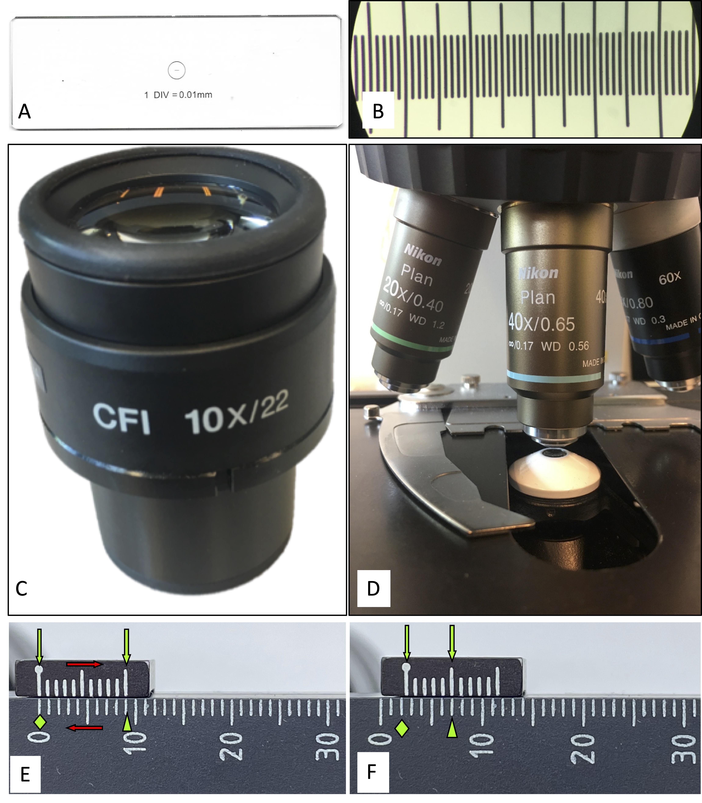

```{r setup, echo = FALSE, message=FALSE}
library(rethinking)
library(tidyverse)
```

# With high-power comes great responsibility.
Mitoses could signal biological aggressiveness. Most drugs used in oncology inhibit cell proliferation (unfortunately, not only the tumor's one), therefore it is wise to limit the use of these drugs in patients who might benefit from them. In most cases, chemotherapy -- neoadjuvant or adjuvant -- is given in high-grade tumors and we see results since many grading systems use mitotic count [@Cree2021]. In the beginning, mitotic count was reported as the total number of mitoses counted over a surface expressed in number of high-power fields (HPF). The problems with mitotic count are multiple and well-established [@Ellis1981; @Sadler1989; @Cree1996; @Cross1996; @Jannink1996; @Facchetti2005]. Given that mitoses are identified and  recognized,^[Basophilic, dark, hairy material (the chromosomes) must be present, either clotted (as in the beginning of metaphase), in a plane (as in metaphase and anaphase), or in separate clots (as in telophase).[@Jannink1996]] quite a few variables can ruin your count: among them delayed fixation can reduce mitotic activity, tumor heterogeneity can limit reproducibility, thicker slices can increase the count. Still, the most discussed variable is the surface area evaluated. Digital pathology will at least solve  this problem [@Balkenhol2019; @Tabata2019; @Wang2021], but since it is not implemented in most centers, many pathologists still peer with their own eyes HPFs of different surfaces. 

# How big is that HPF?

## Know thyself.
How to consistently assess the same surface area? Most of the _Blue Books_ by the WHO report a table that converts diameter to  surface (Table \@ref(tab:useful)). Useful, if you forgot how to compute the area of a circle starting from the diameter,^[
Which is, by the way, computed with the following formula: given the diameter $d$ the surface of a circle $S$ is: $S = d^2 * \pi / 4$.] but you know the diameter of your field of view with an accuracy of 10 $\mu m$. Every medical student or pathology resident approaching the microscope for the first time wrestles with the calculation of the field diameter. Some win, and timidly write the numbers with a permanent marker on the microscope base, many others -- encouraged by prominent textbooks, popular guidelines^[For example, in _Practical Soft Tissue Pathology_ [@hornick2017practical] -- a book that I like and encourage to read -- the author reports _"5 $mm^2$ is equivalent to approximately 20 high-power (40×) fields"_ (p. 470); similarly the Cancer Protocol Templates of the College of American Pathologists of GIST states _"5 mmq approximated with 20-25 HPF"_.[@CAP2021GIST]] and older colleagues -- wave their hands and approximate. Here we will review three ways to accomplish this task.

```{r useful, echo=FALSE}
f_d <- seq(0.40, 0.69, by = 0.01)
f_a <- f_d^2 * pi / 4
one_mmsq <- round(1/f_a)
table <- data.frame(f_d,round(f_a, 3) , one_mmsq)
colnames(table)[1] <- 'HPF diameter ($mm$)' 
colnames(table)[2] <- 'HPF area  ($mm^2$)'
colnames(table)[3] <- 'n. of HPF per $1 mm^2$'
knitr::kable(table, caption = "A table of questionable usefulness.", escape = FALSE)
```


## The ruler.
As pathologists we are used to measure stuff. Ruler and scale are necessary even for autopsies. In surgical pathology, size matters more than weight and residents and pathologist's assistants measure, ruler at hand, fragments, surgical specimens and tumors. Can we use a ruler under the microscope? Sure! Some tasks -- such as measuring the tumor size -- can be done with precision under the microscope by sliding a transparent ruler together with the slide.^[Even if this practice can itself produce unexpected problems.[@Tran2015]] Okay, but we need to measure fractions of millimeters. What if we had a teeny-tiny ruler on a glass slide to measure the diameter of the field of view? That would be awesome! Good news, they do exist and they are cheap too! Try to put "stage calibration slide micrometer ruler" in your favorite search engine and you will see an image similar to Figure \@ref(fig:main)A [@slide_micrometer]. Before you buy it, check whether someone in your department already has it, hidden and forgotten in a drawer. Once you hold the slide in your hand, the game is clear. Put it under the microscope (you will see figure \@ref(fig:main)B), and do what your -- pathologically trained -- eyes are doomed to do: measure with precision the size of your HPF. Slide the last tick to the end of the visible field and count the ticks. Let's say you counted 0.52 $mm$, now you can plug this value into the formula to compute the area of a circle starting from the diameter (or use the table \@ref(tab:useful)) and _voilà_ you have the surface of your microscope HPF (in our example 0.2124 $mm^2$).

```{r main, echo=FALSE, out.width = '90%', fig.align = 'center', fig.cap = "Three ways -- two useful -- to calculate the diameter of the field of view. The top panels show the stage micrometer slide method: to measure your field of view, bring the thing (A), put it under the microscope and count the ticks (B); in this case each tick is at 0.01 mm of distance. Middle panels show an eyepiece (C) and an objective (D): a simple division will provide you the size of your field of view. Lower panels shows how to use the Vernier scale. The lower ruler shows millimeters, the upper shows ticks at 0.9 mm. When the zeros are aligned (E, green diamond), the tenth tick of the small ruler falls on nine millimeters (E, arrowhead). Sliding the slides (E, red arrows), the rulers will misalign the zero tick on the small ruler falls after 2 mm (F, green diamond) and the fifth tick of the upper ruler aligns with the lower one, meaning that it moved of 0.5 mm (F, green arrowhead), therefore the two rulers slide for 2.5 mm. "}



```

## A bit of physics.
Our diagnoses are made by slamming photons into tissue, sometimes using quantum properties of light.^[Birefringence under polarized light exploits quantum properties of photons [@photons].] Therefore, understanding a bit of optics can be useful. The width of the field under the microscope is a function of the eyepiece's width and the objective's magnification. These data have been under your nose the whole time. Look at the eyepiece (Figure \@ref(fig:main)C). There are two numbers: the first, followed by an "X", indicates the magnification of the lens; the second, after a "/" is the width of your eyepiece in $mm$. Now look at your 40X objective (Figure \@ref(fig:main)D). You can see quite a few numbers, but you already know the magnification factor! To calculate the diameter ($d$) in $mm$ you just need to divide the width of your eyepiece (in $mm$) -- called field number ($f_n$) -- by all the magnification factors. Often the only one present is the magnification of the objective ($m_o$) so: $d = f_n / m_o$.^[In the websites describing this procedure [@nikon; @olympus] you will also find reported  the _tube lens magnification factor_ that refers to the tube that often connects a fixed camera to the microscope; the point is that any magnification ($m_x$) intervening before the eyepiece shall be counted, and magnifications multiply. Thus, the extended formula is $d = f_n / (m_o * m_x)$.] For example, for a 22 $mm$ eyepiece and a 40X objective, in the absence of any further magnification, the diameter of the field is 0.55 $mm$ and the surface is therefore 0.238 $mm^2$.  

## Stargazing.
Have you ever seen an astronomical quadrant? It has something in common with your microscope (and calipers). It is the Vernier scale (named after the French mathematician Pierre Vernier). Look at the stage of the microscope, you will see two opposing rulers --  on two of the four sides. Look closer (Figure \@ref(fig:main)E). The shorter ruler is not perfectly aligned to the longer one, it is fine. This is the Vernier scale. It allows you to measure lengths with the precision of 0.1 $mm$. How does it work? Align the two 0 on the two rulers, the tenth tick of the shorter ruler will be on the ninth tick of the longer one. The latter is a regular ruler with the ticks in millimeters. The shorter one shows the ticks at 0.9 $mm$, therefore when the _zeros_ are aligned, the tenth tick falls on the ninth tick of the longer ruler (9 $mm$). Gently move the stage and the rulers will misalign (Figure \@ref(fig:main)F). Now to understand how much you moved, you have to see where the _zero_ of the short ruler falls (this will be the millimeters you moved) and which tick of the short ruler aligns with the tick of the long one (this will be the tenth of $mm$ you moved). Although this method might help you when navigating with an astronomical quadrant, it is the most complicated presented and also the least accurate (only to 0.1 $mm$).

# How much precision is needed?
## To err is human.
Now you have the size of your field of view. You might ask: _"How far off-target was I?"_ The terms of the problem were stated by Ellis and Whitehead. In 1981 they surveyed all the  microscopes marketed at the time and hypothesized a grim scenario by comparing the performance of the two extreme microscopes resulting in a 6-fold difference [@Ellis1981]. This result led them to question the value of mitotic count as a marker of malignancy (in the context of smooth muscle tumor). The paper is often cited as seminal in recognizing the problem of HPF,[@Cree2021] therefore, it is useful to give it a look. Gazing at the plotted numbers, they are not so bad. Seventy percent of the marketed microscopes have a median field of view equal to 0.38 $mm$ with an interquartile range (IQR) of  0.35--0.45 $mm$ -- note that the upper limit is close to the modern microscopes.^[Those of the cited guidelines.] The remaining 8 marketed microscopes depart from the previous group, with a median field of view of 0.66 $mm$ (IQR 0.6--0.7 $mm$). They were outliers at the time and they would be outliers today as well. Let's use the data at hand: in their example of 5 mitoses per $mm^2$, it is true that the extreme microscopes would give very different counts (4 vs 21), but if we do a simple summary statistics of the counts instead of comparing the extremes, numbers are not so grim (median is 8 mitoses and IQR 5--14; i.e. half of the counts differ at most by 9 mitoses), and today they would be even less so -- with less variation among the marketed microscopes. Moreover, what is most reassuring is that outliers are rare in the market: the bulk of the microscopes out there are alike and therefore the scenario is further tempered.

```{r ellis, echo=FALSE, fig.cap="Graphical representation of the data from the seminal paper of Ellis and Whitehead [@Ellis1981]. The overall median and IQR are represented by the solid black line and the gray shade; the median and IQR of the two _types_ of microscopes are in colored dashed lines and shades: this representation clearly shows the outliers (in green)."}
dia <- c(.45,.45,.3,.725,.6625,.35,.45,.35,.45,.375,.7,.6,.375,.7,.6,.375,.6,.45,.35,.6635,.3125,.45,.45,.3125,.33,.41,.37)
dia.o <- dia[order(dia)]
plot(NULL, xlim = c(0,length(dia)), ylim = range(dia), xlab = "Marketed microscopes", 
     ylab = "Field of view diameter (mm)", 
     main = "Marketed microscopes on 1981")

polygon(c(-1,length(dia)+1, length(dia)+1, -1), 
        quantile(dia,c(.25,.25, .75, .75)),
        col = col.alpha("black", 0.15), border = NA)
abline(h = quantile(dia,c(.5)), lwd = 2)


polygon(c(-1,length(dia)+1, length(dia)+1, -1), 
        quantile(dia[dia<=0.5],c(.25,.25, .75, .75)),
        col = col.alpha(4, 0.15), border = NA)
abline(h = quantile(dia[dia<=0.5],c(.5)), col = 4, lty = 2)

polygon(c(-1,length(dia)+1, length(dia)+1, -1), 
        quantile(dia[dia>=0.5],c(.25,.25, .75, .75)),
        col = col.alpha(3, 0.15), border = NA)
abline(h = quantile(dia[dia>=0.5],c(.5)), col = 3, lty = 2)


points(dia.o, col = as.numeric(dia.o<=0.5) + 3, pch = 16 )


# quantile(dia[dia>=0.5],c(.25,.5,.75))
# sur <- dia^2*pi/4
# ten_HPF <- sur*10
# quantile(round(1*ten_HPF), c(0, .25, .5 ,.75, 1))
```


## The gist of counting.
Today, with less variation among marketed microscopes, problems might instead arise when the numbers of HPFs reported in papers and books are naively applied without converting them in $mm^2$. Since the error is multiplicative the worst case scenario is when you repeat it the most. The mitotic figures in gastrointestinal stromal tumors (GISTs) are counted over 5 $mm^2$, however, even recent papers on prominent journals report the surface in 50 HPF [@Joensuu2012; @Joensuu2013; @Lasota2016; @Pantaleo2017a]. We read that books and guidelines tell you to approximate 5 $mm^2$ counting between 20 and 25 HPF. If you are not aware of the trick you might also be tempted to count 50 HPF. Now, the _bright line_ in GIST is 5 mitoses/5 $mm^2$: there would be no difference in counts when approximating, whereas using the wrong counting strategy, that uses naively 50 HPF, overestimates the number of mitoses, reporting 5 of them when there were 3 instead (Figure \@ref(fig:gist)). This may be a problem.

```{r gist, echo = FALSE, fig.cap="Effects of miscounting mitoses in GIST. Suppose your microscope has a field of view of 0.52 $mm$, to count 5 $mm^2$ you will need to count 23.5 HPF (black solid lines). This graph illustrates what happens to your mitotic count when you follow the guidelines and approximate with 20 or with 25 HPF (blue and green dashed lines respectively). How much the sloppy resident would be off? (red dashed lines, counting 50 HPF)."}

right <- 23.5
low <- 20/right
high <- 25/right
wrong <- 50/right
counts <- c(low, 1, high, wrong)
cols <- c(4, 1, 3, 2)
ltys <- c(2, 1, 2, 2)
plot(NULL, xlim = c(1,25), ylim = c(1,50), type = 'b' ,
     main = 'The gist of miscounting', xlab = "True mitotic rate", 
     ylab = "Reported mitotc rate", xaxt='n')
axis(1, at = seq(2,24,2))
grid(lty = 1)
for(i in 1:4) abline(a = 0 , b = counts[i], col = cols[i], lty = ltys[i])
abline(h = 5, lty = 3)
labels <- c("Approximation low: 20HPF", "Correct: 23.5HPF", "Approximation high: 25HPF", "Wrong: 50HPF")
legend("topleft", legend = labels[4:1], lty = ltys[4:1], col = cols[4:1], title = 'Fields counted', bg = 'white', cex = 0.7)
text(20,4.5,'5 mitoses reported', pos = 3)

```

## Maybe not.
Mitoses are just part of the picture. They are combined with size and site to compute the risk class [@Miettinen2006]. This is true also for other pathologies: mitoses do not determine grading on their own. To understand the impact let's look at an example. Figure \@ref(fig:simulation) is a Montecarlo simulation of 10,000 GISTs. First, the simulation generated random _sites_ respecting the proportion reported in literature [@Joensuu2012]; similarly, it generated _mitoses_; lastly the simulation produced the _sizes_ as a function of _mitoses_ (easy to imagine why) and the _sites_ (with the idea that an esophageal GIST tends to be smaller because symptoms will appear sooner). Now that we have the largest GIST dataset ever built (just good for this example), let's play with it and compute the risk class -- according to Miettinen and Lasota -- for each count. As expected, if you approximate there is almost perfect agreement. The punchline is that even in the worst case scenario (counting 50 HPF instead of 23.5 HPF) there is only a 0.2-fold increase in the _high risk_ class whereas the others are under-diagnosed by a factor of 0.1, with a substantial agreement between the two counting strategies (see figure \@ref(fig:simulation) caption for more details). Not too bad.


```{r  simulation, echo = FALSE, message = FALSE, fig.cap="Impact of miscounting mitoses in GIST. Approximations -- low and high -- have an almost perfect agreement with the right counting strategy (Cohen's K of 0.980 and 1.00 respectively), whereas the wrong counting strategy had a substantial agreement with it (Cohen's K = 0.67). The strength of agreement was evaluated according to Landis and Koch [@Landis1977]. Data generated with a Montecarlo simulation based on descriptive statistics of a series of 2560 cases [@Joensuu2012]."}
#data simulated from parameters of jounsuu et al 2012
N <- 10000
site <- sample(c('stomach','small_i','large_i','other'), 
               N, replace=TRUE, prob = c(0.56,0.37,0.06,0.05))
m_class <- sample(c(1,2,3,4), N, replace=TRUE, prob = c(0.37, 0.29, 0.12, 0.22))
mit_sim <- function(m_class){
  if (m_class == 1){
    rbinom(1,1,0.5)
  } else if (m_class == 2) {
      round(runif(1,2,5))
  } else if (m_class == 3) {
       round(runif(1,6,10))
  } else if (m_class == 4) {
      11 + rpois(1 , 2 )
  }
  }
mic <- sapply(m_class, mit_sim)
site <- factor(site, levels = c('other','large_i','small_i','stomach'))
mu <- 5.5 + standardize(as.numeric(site) + mic)
size <- rlnorm(N, log(mu), 0.5 )
risk_str <- function(size,mic,site){
  if (site == "stomach") {

    if (mic <= 5) {
      
      if (size <= 2) {
        return("none")
      } else if ( size <= 5 ){
        return("very low")
      } else if ( size <= 10 ){
        return("low") 
        } else {
          return( "moderate" )}
      
      } else { # mic > 5
      
      if (size <= 2) {
        return("none")
      } else if ( size <= 5 ){
        return("moderate")
      } else if ( size <= 10 ){
        return("high") 
      } else {
          return( "high" )}
      }} else {

    if (mic <= 5) {
      
      if (size <= 2) {
        return("none")
      } else if ( size <= 5 ){
        return("low")
      } else if ( size <= 10 ){
        return("moderate") 
        } else {
          return( "moderate" )}
    } else { # mic > 5
      
      if (size <= 2) {
        return("high")
      } else if ( size <= 5 ){
        return("high")
      } else if ( size <= 10 ){
        return("high") 
      } else {
          return( "high" )}}}}
risk_gist <- matrix(ncol= 4,nrow = N)
risk_gist <- data.frame(risk_gist)
colnames(risk_gist) <- c('low', 'right', 'high', 'wrong')

for(i in 1:N) {
  risk_gist[i,1] <- risk_str(size = size[i], mic = round( low * mic[i]), site = site[i])
  risk_gist[i,2] <- risk_str(size = size[i], mic = mic[i], site = site[i])
  risk_gist[i,3] <- risk_str(size = size[i], mic = round( high * mic[i]), site = site[i])
  risk_gist[i,4] <- risk_str(size = size[i], mic = round( wrong * mic[i]), site = site[i])
}

k.calc <-function(x){
  # Contingency table
  xtab <- table(risk_gist[,2],risk_gist[,x])
  # Descriptive statistics
  diagonal.counts <- diag(xtab)
  N <- sum(xtab)
  row.marginal.props <- rowSums(xtab)/N
  col.marginal.props <- colSums(xtab)/N
  # Compute kappa (k)
  Po <- sum(diagonal.counts)/N
  Pe <- sum(row.marginal.props*col.marginal.props)
  k <- (Po - Pe)/(1 - Pe)
  return(k)
} # calculates the K statistics

# sapply(1:4, k.calc) #1 Low 2 reference 3 high, 4 wrong 

risk_gist.g <- risk_gist %>% gather('low', 'right', 'high', 'wrong', key = 'miscount', value = 'risk')
risk_gist.g[,1] <- factor(risk_gist.g[,1], levels = c('low', 'right', 'high', 'wrong') )
risk_gist.g[,2] <- factor(risk_gist.g[,2], levels = c("none", "very low", "low",  "moderate", "high") )

risk_gist.g %>% ggplot(aes(miscount, fill = risk)) +
  geom_bar(aes(y = (..count..)/10000),position = "dodge") +
    theme_bw() +
  theme(legend.position = "bottom") +
  scale_y_continuous(labels = scales::percent_format(accuracy = 1), name = "Proportion") +
  labs(x = "Type of miscounting", y = "Number of cases", 
       title = "Impact of miscounting", fill = "Risk class")+
  scale_x_discrete(breaks=c('low', 'right', 'high', 'wrong'),
        labels=c('Low (20HPF)', 'Right (23.5HPF)', 'High (25HPF)', 'Wrong (50HPF)'))+
  scale_fill_discrete(breaks = c("none", "very low", "low",  "moderate", "high"), 
                     labels = c("None", "Very-low", "Low",  "Moderate", "High") )


```


# Not just counting.
Since we will soon be confronted with machines, it is time to be precise and accurate. To do this with your peers, you need to know the size of your HPF. Now you know _how to_ measure it. Do it now! Lastly, even in the worst case scenario, the results are not so grim, and pathology is not just counting.

# References.

